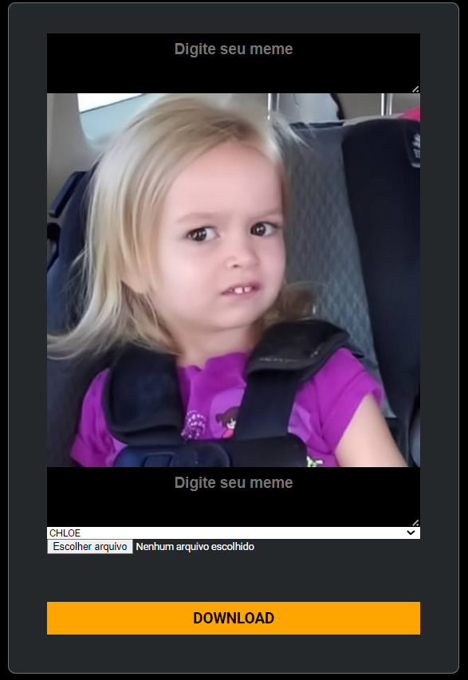

<h1 align="center"> MÁQUINA DE MEMES</h1>

Desenvolvido através de evento exclusivo e gratuito, promovido pela DIO.

  <a href="#-tecnologias">Tecnologias</a>&nbsp;&nbsp;&nbsp;|&nbsp;&nbsp;&nbsp;
  <a href="#-projeto">Projeto</a>&nbsp;&nbsp;&nbsp;|&nbsp;&nbsp;&nbsp;
  <a href="#-layout">Layout</a>

 

  | 
| :---: | :---: |
 

## 🚀 Tecnologias

Esse projeto foi desenvolvido com as seguintes tecnologias:

- HTML e CSS
- JavaScript
- Git e Github

 

## 💻 Projeto

A Máquina de Memes é uma plataforma web que possibilidade a produção personalizada de memes e disponibiliza para download 🖨️.